This directory contains python script to train and evaluate classifiers using cleaned and preprocessed manually annonated jod ads data (df_manual) and classify cleaned and preprocessed scraped job ads data (df_jobs).

* All data are stored in the data directory under the final dfs directory. You can find the data in:
  - [data](../data) &rarr; [final dfs](../data/final%20dfs/)
  - Cleaned and preprocessed manually annotated job ads data (df_manual) is stored in the data directory. You can find the data in:
    - [data](../data) &rarr; [final dfs](../data/final%20dfs/) &rarr; [df_manual_for_analysis.pkl](../data/final%20dfs/df_manual_for_analysis.pkl)
  - Unclassified cleaned and preprocessed job ads data (df_jobs) is stored in the scraping directory. You can find the data in:
      - [data](../data) &rarr; [final dfs](../data/final%20dfs/) &rarr; [df_jobs_for_classification.pkl](../data/final%20dfs/df_jobs_for_classification.pkl)
  - Classified (not cleaned) job ads data (df_jobs) is stored in the scraping directory. You can find the data in:
      - [data](../data) &rarr; [final dfs](../data/final%20dfs/) &rarr; [df_jobs_classified.pkl](../data/final%20dfs/df_jobs_classified.pkl)
  - Classified cleaned and preprocessed job ads data (df_jobs) is stored in the scraping directory. You can find the data in:
    - [data](../data) &rarr; [final dfs](../data/final%20dfs/) &rarr; [df_jobs_for_analysis.pkl](../data/final%20dfs/df_jobs_for_analysis.pkl)
* Classification and evaluation output can be found in the following directories:
  - Classifiers: [data](../data) &rarr; [classification models](../data/classification%20models)
  - Visuals: [data](../data) &rarr; [plots](../data/plots)
  - Tables: [data](../data) &rarr; [output tables](../data/output%20tables)

***Note that classifiers are imported from [estimators_get_pipe.py](./estimators_get_pipe.py) in this directory and imports and some functions are imported from [setup_module](../setup_module) directory.***

***Warmth-related frames classification metrics:*** To view warmth-related framing classification metrics, [click here](../Sector%20Keywords,%20Codebook,%20and%20Classification%20Metrics/Warmth-related%20Frames%20Classification%20Metrics.md) or navigate to the markdown file titled ```Warmth-related Frames Classification Metrics.md``` under the directory titled Tables.

***Competence-related frames classification metrics:*** To view competence-related framing classification metrics, [click here](../Sector%20Keywords,%20Codebook,%20and%20Classification%20Metrics/Competence-related%20Frames%20Classification%20Metrics.md) or navigate to the markdown file titled ```Competence-related Frames Classification Metrics.md``` under the directory titled ```Sector Keywords, Codebook, and Classification Metrics```.

***Figure***

*Two-stage procedure for automated content analysis*


